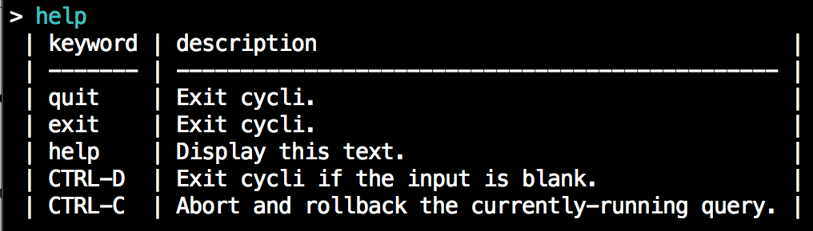

# cycli [](https://travis-ci.org/nicolewhite/cycli)
A Command Line Interface for Neo4j's Cypher Query Language.


## Install

```
$ pip install cycli
```

## Start

To start, simply execute `cycli` from your terminal.

```
$ cycli
```

If you have Neo4j authentication enabled, you'll need to pass a username.

```
$ cycli -u username
```

You will then be prompted to enter your password. For more options, execute `cycli --help`.

## Options

* `-v`, `--version`: Show cycli version and exit.
* `-h`, `--host`: The host address of Neo4j.
* `-P`, `--port`: The port number on which Neo4j is listening.
* `-u`, `--username`: Username for Neo4j authentication.
* `-p`, `--password`: Password for Neo4j authentication.
* `-t`, `--timeout`: Set a global socket timeout for queries.
* `-l`, `--logfile`: Log every query and its results to a file.
* `-f`, `--filename`: Execute semicolon-separated Cypher queries from a file.

## Features

### Autocomplete

The smart autocompletion suggests node labels when you're drawing a node, relationship types when you're drawing
a relationship, and properties when working with identifiers. Of course, it also suggests all of the Cypher keywords,
functions, and predicates.

#### Node Labels


#### Relationship Types


#### Properties


#### Cypher Keywords


#### Opening Characters

If you type `(`, `[`, `{`, `"`, or `'`, a matching closing character is automatically placed to the right of your cursor.


### Syntax Highlighting

Catch syntax errors with the built-in syntax highlighting. The colors were chosen to emulate the syntax highlighting
available in the Neo4j browser.


## Usage

### Execute Queries

Execute queries by ending them with a semicolon and pressing enter or by pressing enter twice.

### Abort Queries

While a query is executing, CTRL-C will abort the query and rollback the transaction.

### Get Help

Type "help" to see a table of keywords / keystrokes and their descriptions.



### Show Schema

Type "schema" to see all schema - labels, relationship types, constraints, indexes

#### Show labels

Type "schema-labels" to see only labels

#### Show relationship types

Type "schema-relations" to see only relationship types

#### Show constraints

Type "schema-constraints" to see only constraints

#### Show indexes

Type "schema-indexes" to see only indexes

### Refresh schema cache

Type "refresh" to refresh cycli console cache for the schema. Useful when there is some update in schema, while the console is open

### Run a cypher N times

Type "run-10" (say) followed by cypher to run a cypher N times. Useful when you want to make a huge update, and would prefer updating records in 1000 batch (say) 100 times, rather than updating 1,00,000 records with single run.

### Exiting

Exit cycli by typing "quit" or "exit" or by pressing CTRL-D on an empty line.

## Credits

This project depends heavily on [python-prompt-toolkit](https://github.com/jonathanslenders/python-prompt-toolkit) and
[py2neo](https://github.com/nigelsmall/py2neo).