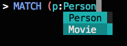
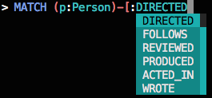
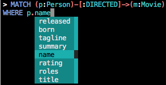
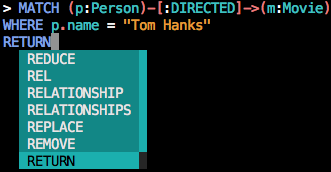
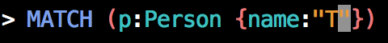
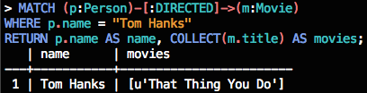

# cycli [](https://travis-ci.org/nicolewhite/cycli)
A Command Line Interface for Neo4j's Cypher Query Language.


## Install

```
$ pip install cycli
```

## Start

To start, simply execute `cycli` from your terminal.

```
$ cycli
```

If you have Neo4j authentication enabled, you'll need to pass a username.

```
$ cycli -u username
```

You will then be prompted to enter your password. For more options, execute `cycli --help`.

## Options

* `-v`, `--version`: Show cycli version and exit.
* `-h`, `--host`: The host address of Neo4j.
* `-P`, `--port`: The port number on which Neo4j is listening.
* `-u`, `--username`: Username for Neo4j authentication.
* `-p`, `--password`: Password for Neo4j authentication.
* `-t`, `--timeout`: Set a global socket timeout for queries.
* `-l`, `--logfile`: Log every query and its results to a file.
* `-f`, `--filename`: Execute semicolon-separated Cypher queries from a file.
* `-r`, `--read-only`: Don't allow write queries.

## Features

### Autocomplete

The smart autocompletion suggests node labels when you're drawing a node, relationship types when you're drawing
a relationship, and properties when working with identifiers. Of course, it also suggests all of the Cypher keywords,
functions, and predicates.

#### Node Labels



#### Relationship Types



#### Properties



#### Cypher Keywords



#### Opening Characters

If you type `(`, `[`, `{`, `"`, or `'`, a matching closing character is automatically placed to the right of your cursor.



### Syntax Highlighting

Catch syntax errors with the built-in syntax highlighting. The colors were chosen to emulate the syntax highlighting
available in the Neo4j browser.



## Usage

### Execute Queries

Execute queries by ending them with a semicolon and pressing enter or by pressing enter twice.

### Keywords

Type "help" to see a table of keywords / keystrokes and their descriptions.

Keyword            | Description
-------------------|--------------------------------------------------------------
quit               | Exit cycli.
exit               | Exit cycli.
help               | Display this text.
refresh            | Refresh schema cache.
run-n              | Run a Cypher query n times.
schema             | Display indexes, constraints, labels, and relationship types.
schema-indexes     | Display indexes.
schema-constraints | Display constraints.
schema-labels      | Display labels.
schema-rels        | Display relationship types.
CTRL-D             | Exit cycli if the input is blank.
CTRL-C             | Abort and rollback the currently-running query.

### `run-n`

Run a Cypher query `n` times. This is useful for large updates, e.g. if you want to update a property in batches.

```
> MATCH (n) RETURN COUNT(*);
   | COUNT(*)
---+----------
 1 |      456

26 ms
```

Let's say we want to add a new property in batches of 100. If we have 456 nodes, we'll need to run the same Cypher query
5 times.

```
> run-5 MATCH (n)
WHERE NOT HAS(n.newProperty)
WITH n LIMIT 100
SET n.newProperty = "Hello World"
RETURN COUNT(*);
   | COUNT(*)
---+----------
 1 |      100

Run 1: 44 ms

   | COUNT(*)
---+----------
 1 |      100

Run 2: 8 ms

   | COUNT(*)
---+----------
 1 |      100

Run 3: 8 ms

   | COUNT(*)
---+----------
 1 |      100

Run 4: 10 ms

   | COUNT(*)
---+----------
 1 |       56

Run 5: 9 ms

Total duration: 79 ms
```

## Credits

This project depends heavily on [python-prompt-toolkit](https://github.com/jonathanslenders/python-prompt-toolkit) and
[py2neo](https://github.com/nigelsmall/py2neo).